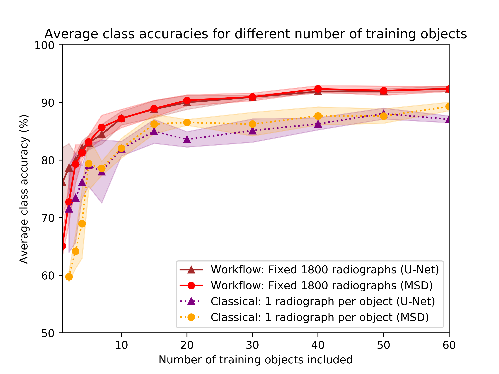
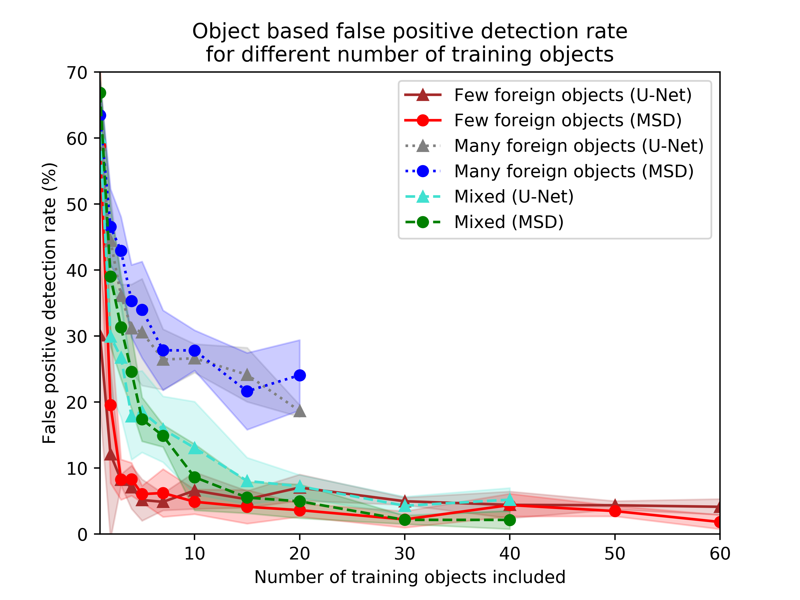

# <a href="https://www.sciencedirect.com/science/article/pii/S0957417422010429" style="color: black;">DeepFODDataGenerator</a>: A workflow for generating deep learning data for X-ray based object detection

   <p align="center">
   
    </p>
    
## Introduction

DeepFODDataGenerator is a Python package for easy generation of training data to apply deep learning for detection of (foreign) objects detection on X-ray projections. The generator follows a workflow of creating reconstructions from CT scans of training objects, and subsequently applying segmentation and virtual projections. The results are ground truth locations of the foreign objects on the X-ray projections from the CT scan, without having to manually annotate each of these.  

This package provides scripts for applying this workflow for any X-ray object detection method, given that there are CT objects of training objects available. Additionally, the package provides scripts for complete reproduction of the experiments in the associated paper titled '[A tomographic workflow to enable deep learning for X-ray based foreign object detection](https://www.sciencedirect.com/science/article/pii/S0957417422010429)', in which the workflow is demonstrated and analyzed through a series of experiments with laboratory CT data and numerical data.  


## Requirements

Running the scripts requires a number of major and minor packages:

**Major**:
1. ASTRA Toolbox:
https://github.com/astra-toolbox/astra-toolbox
2. MSDNet:
https://github.com/dmpelt/msdnet
3. PyTorch:
https://pytorch.org/

Minor (but essential):
csv, cv2, matplotlib, numpy, pickle, scipy, sklearn, tiffile, tqdm

*Optional*:
physdata.xray, pyqtgraph (useful for plotting and examining intermediate results)


## Scripts


## Example results:

Below are sample results of comparisons of two quality measures between different training approaches with data generated by the workflow:
   <p align="center">
   
   
   </p>
   

## References

The algorithms and routines implemented in this Python package are described in following [paper](https://www.sciencedirect.com/science/article/pii/S0957417422010429) published in Expert Systems with Applications. If you use (parts of) this code in a publication, we would appreciate it if you would refer to:

```
@article{,
  title={A tomographic workflow to enable deep learning for X-ray based foreign object detection},
  author={Zeegers, Math{\'e} T and van Leeuwen, Tristan and Pelt, Dani{\"e}l M and Coban, Sophia Bethany and van Liere, Robert and Batenburg, Kees Joost},
  journal={Expert Systems with Applications},
  volume={206},
  pages={117768},
  year={2022},
  publisher={Elsevier}
}
```
The preprint can be found [here](https://arxiv.org/abs/2201.12184).

The X-ray CT scans dataset required to run the experimental data scripts can be found at [Zenodo](https://zenodo.org/record/5866228).


## Authors

Code written by:
- Mathé Zeegers (m [dot] t [dot] zeegers [at] cwi [dot] nl).

The MSD and UNet training scripts contain elements of MSD code (https://github.com/dmpelt/msdnet) by Daniël Pelt and PyTorch UNet code (https://github.com/usuyama/pytorch-unet) by Naoto Usuyama respectively.
